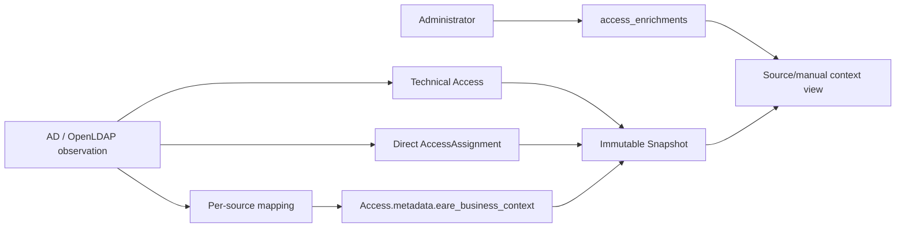
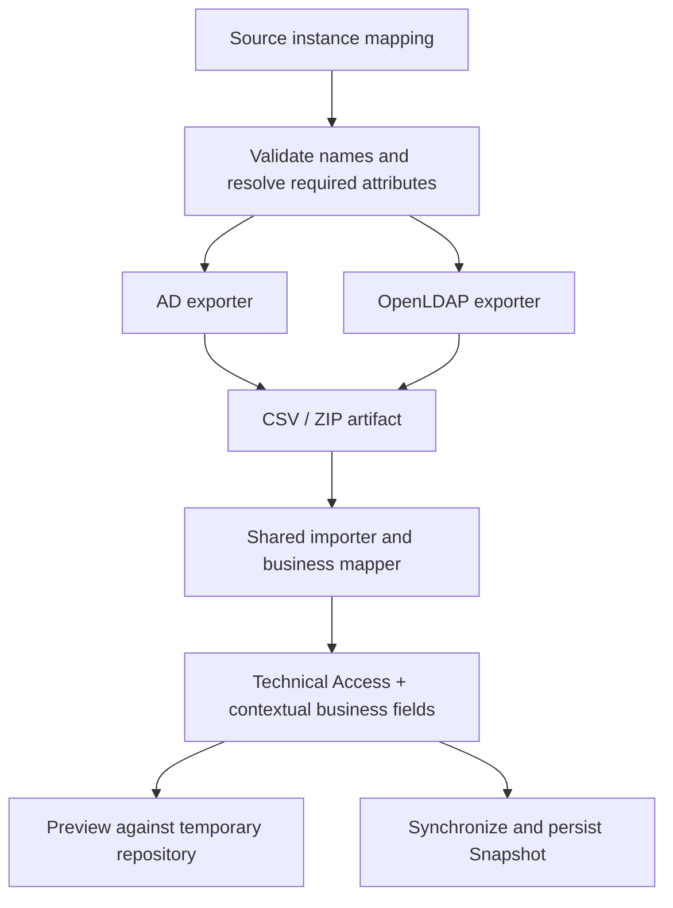
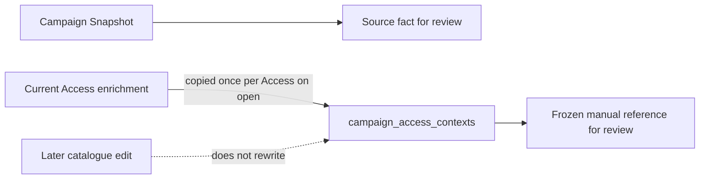
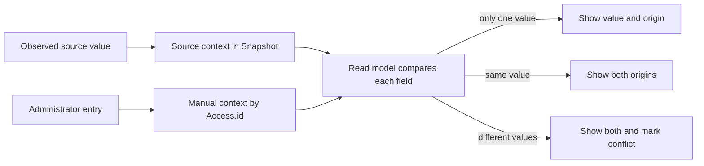
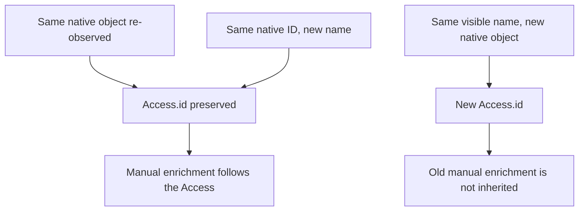
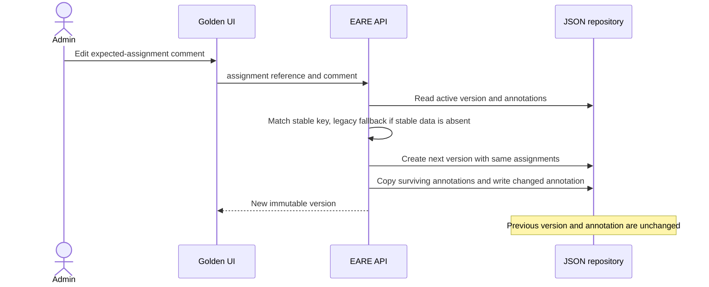
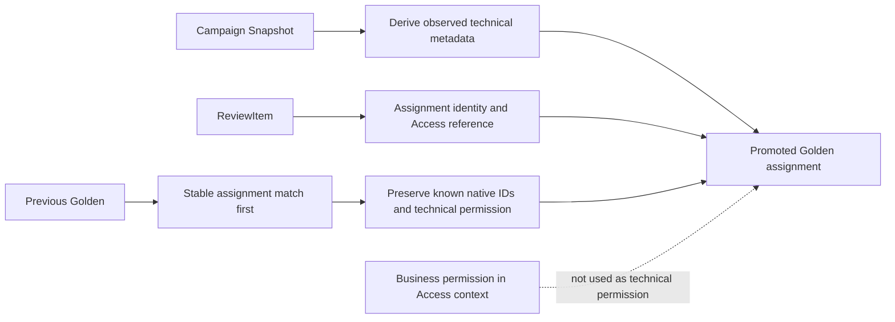
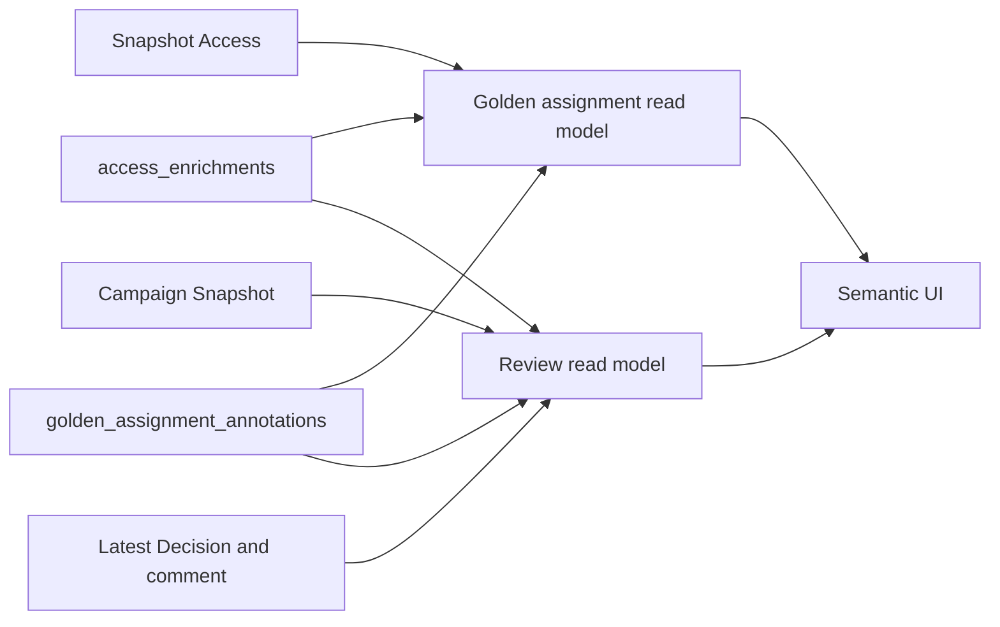

# Source mapping and business context design

## Purpose and boundaries

This feature gives AD/OpenLDAP Access objects descriptive business context while preserving EARE's
existing access model and behavior.

For a directory group, the technical entitlement remains:

```text
+-------------+---------------------------+
| Access      | GG_SAGE_COMPTA_RW:member |
| Permission  | member                    |
| Grant       | Group membership          |
+-------------+---------------------------+
```

Application, business Permission and Resource describe that technical access. They do not replace
technical permission, alter an Access key, create a derived business Access or create an artificial
AccessRelation. EARE does not connect to target applications to validate their ACLs.

Identity business keys remain `(provider, identifier)`; Access business keys remain
`(provider, name)`. Native IDs remain reconciliation aids. AccessAssignment remains a directly
observed assignment. AccessRelation and AccessPath retain their existing composition and provenance
semantics. A Snapshot remains an immutable observation. Golden remains expected direct assignments.
Decisions remain append-only.



Example source fields:

```text
Description = Finance access
extensionAttribute5 = Sage
extensionAttribute6 = ReadWrite
extensionAttribute7 = Invoices
```

EARE observes group membership / member and stores Sage / ReadWrite / Invoices as context. This does
not claim that the Sage ACL actually grants ReadWrite over Invoices.

## Per-source mapping

Mapping belongs to each source instance. Connector defaults apply unless that instance overrides
them. Two AD sources may use different attributes.

```yaml
provider: ad-corp
type: active_directory
business_mapping:
  display_name: { mode: default }
  description: { mode: default }
  application: { mode: attribute, attribute: extensionAttribute5 }
  business_permission: { mode: attribute, attribute: extensionAttribute6 }
  resource: { mode: attribute, attribute: extensionAttribute7 }
  owner: { mode: default }
```

V1 supports only `default`, `attribute`, `static` and `none`.

- AD defaults: Display name from Name, falling back to SamAccountName; Description from Description;
  Owner candidate from managedBy.
- OpenLDAP defaults: Display name from cn; Description from description; Owner candidate from owner.
- Application, business Permission and Resource have no semantic defaults.
- Group names are not parsed.
- No regex, script, expression language, conditional pipeline, canonicalization or cross-source
  matching is used.

Attribute names are treated as data, syntax-checked and rejected if sensitive or involved in
technical reconciliation/membership. Examples include SID, ObjectGUID, PrimaryGroupID,
foreign-security-principal resolution, entryUUID, DN, member, uniqueMember and memberUid. Ordinary
synchronization requests only connector-required fields and configured extra attributes. Existing
identity and membership collection is controlled by the connector.

### Shared collection, preview and sync logic



Preview and Synchronize call the same import and mapping logic. Preview imports against a temporary
SQLite backup and discards it. Synchronize persists the observation. Thus the mapping result is the
same without creating production state during Preview.

An offline artifact that contains a configured field uses it. An older artifact without that
optional field produces no fabricated value and Preview reports it as unavailable. A mapping change
affects the next collected Snapshot only; earlier Snapshots keep the context observed at their
collection time.

When an Access is re-observed, the reserved `eare_business_context` namespace is replaced. If a
previously mapped value disappears, the new observation drops it. Unrelated metadata is retained.
Objects outside a scoped or non-authoritative observation remain untouched under existing
reconciliation rules.

## Provenance and manual reference values

Provenance stays factual and small:

- `source_attribute`: the value was read from the source; `mapping_mode` says `default` or
  `configured`. A default such as AD `Description` is still a source attribute, not native IAM
  semantics.
- `static`: an administrator configured a fixed reference value.
- `manual`: an administrator entered a catalogue reference value.
- `native_semantic` is reserved for a future connector that natively exposes the business meaning.

Source fact means only that the source reported the value. An AD/LDAP business-permission field
and mapping coverage do not verify the actual permission in a target application. No confidence
score or remote ACL validation is performed.

Source context is structured on Access metadata and is included in the Snapshot. Manual Access
enrichment is stored separately in `access_enrichments`, keyed by stable internal `Access.id`.
Fields are Application, business Permission, Resource, Description and Owner. It is not attached to
individual Golden assignments and does not mutate Snapshot contents. At campaign opening, the current
manual reference values are copied once per distinct Access into `campaign_access_contexts`. Open and
closed reviews use that frozen record, while source facts continue to come from the campaign Snapshot.
A legacy campaign without a captured record is explicitly marked uncaptured; current catalogue values
are not substituted as historical evidence. Draft previews may use live catalogue context.





Read models keep source and manual values separate:

```json
{
  "source": {
    "value": "ReadOnly",
    "provenance": "source_attribute",
    "attribute": "extensionAttribute6"
  },
  "manual": {
    "value": "ReadWrite",
    "provenance": "manual"
  },
  "conflict": true
}
```

Equal values may be shown once with both origins. A difference is visible as a conflict; neither
value silently overwrites the other.

Access.id reconciliation gives the intended lifecycle:



## Read-only Source Browser

Administrators can use Browse source from Sources & IdPs. It supports fixed kinds (users and groups),
search, bounded paging, object details, safe raw values, attribute discovery and sample coverage.
The EARE service connects using the configured source. The feature is read-only and has no source
edit/create/delete/rename, membership write, password change, arbitrary LDAP query or shell action.

The backend uses a small generic interface: list object kinds, search summaries, get details and
discover attributes. The AD adapter invokes a fixed PowerShell script. The OpenLDAP adapter invokes
a fixed ldapsearch argument vector. Neither interpolates the search term or attribute into executable
code. LDAP filter values are escaped; attribute names are validated. DN detail requests must remain
inside the configured base DN.

Page size, offset, sample count, number of returned values, value length, subprocess timeout and
response byte size are bounded. Sensitive attributes and binary values are omitted. Credentials use
existing secret environment/password-file conventions and are never returned or audited. Browser
and mapping administration follow the existing ADMIN source-administration permission boundary.
The regular source listing keeps its existing access policy.

The field picker suggests common connector fields, configured custom fields and safely sampled
fields where available. It is intentionally not a schema-introspection engine: administrators may
type a custom field name, which is validated against the same denylist. No `Properties *` or LDAP
`*` request is used. Coverage is only the percentage populated in at most 50 sampled objects; it
says nothing about permission correctness. Test connection returns connectivity and mapping
diagnostics separately. A missing optional mapped field is a warning; it does not make a successful
connection fail. Test data is temporary and creates no identities, accesses, Snapshot, Golden version
or Campaign.

## Golden version and assignment comments

The existing `GoldenSourceVersion.comment` is the global version comment. A distinct comment on an
expected assignment explains why one identity should have one Access. These assignment comments use
`golden_assignment_annotations`, keyed by Golden version ID and the technical assignment reference;
they are not stored on the locked `GoldenSourceAssignment` domain object.

Matching is stable native metadata first. The legacy assignment key is a fallback only when stable
metadata is absent. Display names are not keys. When creating a new Golden version, comments for
logical assignments that remain are copied. Removed assignment comments stay only on old versions;
new assignments inherit no unrelated comments. Editing an assignment comment creates a new
immutable Golden version with unchanged assignments and current Golden authentication policy. Its
assignment checksum may equal its parent's checksum.



Golden rationale and Review rationale answer different questions. The Golden comment explains why
the assignment is expected. Review comment is the existing append-only `Decision.comment`, explaining
why the reviewer approved, revoked or marked it not applicable now. The latest Decision determines
current state; prior Decision rows remain. Review never copies a decision comment into Golden.

### Campaign promotion

A new approved assignment derives technical native IDs and permission from the campaign Snapshot
and technical ReviewItem fields only. An assignment matched to a previous Golden assignment retains
known technical stable metadata. Unknown IDs or permissions remain absent. Contextual business
Permission never becomes Golden `access_permission`.



## Persistence, API and read models

The MVP keeps the Repository's SQLite JSON-payload style. Two tables are added:

| Table | Key | Contents |
| --- | --- | --- |
| `access_enrichments` | Internal `Access.id` | Manual reference fields plus created/updated actor/time |
| `campaign_access_contexts` | Campaign plus stable Access reference | One frozen manual-context copy per Access at open time |
| `golden_assignment_annotations` | Golden version ID plus full assignment reference | Version-specific comment and update metadata |

Source configuration stores mapping rules. Access metadata stores source-observed context. Manual
reference data, campaign context and assignment annotations are separate records. No mapping rules or business
permission values are inserted into Golden technical assignment metadata.

A small connector-capability record declares attribute mapping, safe sampling, Source Browser and
native permission/target support. AD/OpenLDAP support mapping and safe browsing, but do not provide
native business permissions or targets. Protocol execution remains in their existing adapters.

The API exposes mapping as part of source configuration; safe inspector routes under
`/api/system/sources/{provider}/inspect`; manual Access read/update under
`/api/accesses/{access_id}/enrichment`; and Golden assignment comment mutation under
`/api/golden-sources/{name}/assignment-comment`. Existing role checks apply. Meaningful mutations
are audited without source raw values or secrets.

Golden and Review endpoints provide normalized business context, provenance, conflicts, technical
grant mechanism, Golden comment and current Decision/comment. React does not infer AD attribute
semantics. Application counts come from actual Application context values, not providers.



## Verification focus

Regression tests cover:

- AD and OpenLDAP technical group permission remaining `member`.
- Access key and identity key remaining unchanged when business context changes.
- Configured attributes being requested; sensitive and technical attributes being rejected.
- Removed source fields clearing stale context without erasing unrelated metadata.
- Source/manual equality and conflict, Access.id rename survival, and replacement-object isolation.
- Historical Snapshot and Golden version immutability.
- Golden annotation matching and copy behavior across versioning.
- Decision comments remaining append-only and independent of Golden rationale.
- Promotion preserving stable technical metadata without substituting business Permission.
- Browser bounds, sensitive redaction, LDAP filter escaping and read-only behavior.
- Scoped collection safety and unchanged effective-access traversal.
